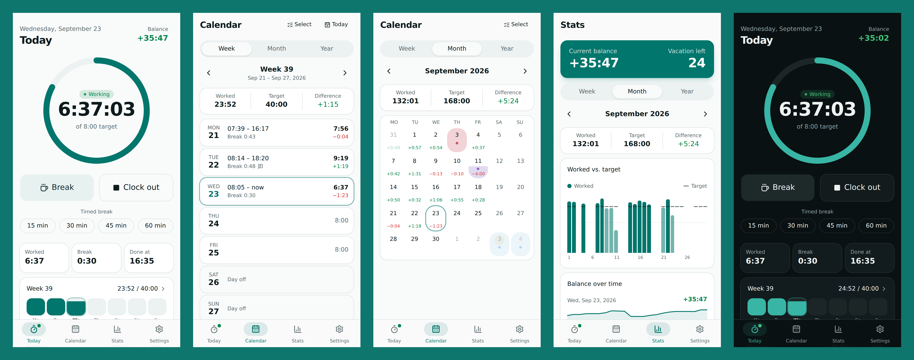
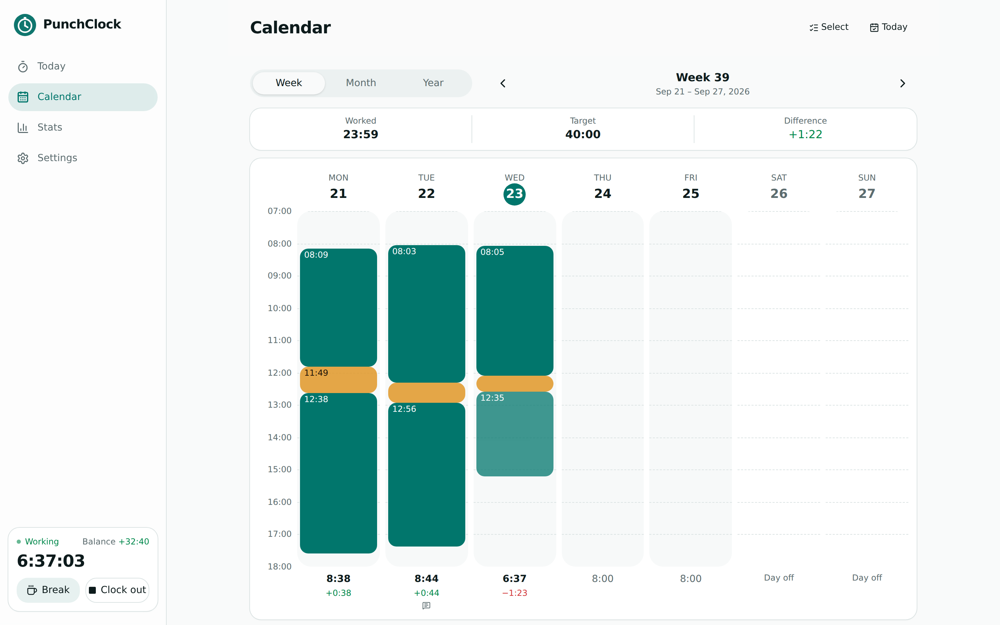

<h1 align="center">PunchClock</h1>

<p align="center">
  <a href="https://spenhouet.com/punch-clock/"></a>
</p>

<p align="center">
  <em>A simple, offline time tracker for one person. Clock in and out, take breaks, track overtime and vacation, export timesheets. Runs in the browser, installs as a PWA and ships as an Android app. English and German.</em>
</p>

<p align="center">
  
</p>

<p align="center"><a href="https://spenhouet.com/punch-clock/">Open the web app</a> · <a href="https://github.com/Spenhouet/punch-clock/releases/latest">Download the Android app</a></p>

## Features

- **One tap to clock in, out, and into a break.** Clock in and out as often as needed; each stretch is stored as its own entry. Timed breaks (15, 30, 45, 60 min, configurable) end by themselves.
- **Live overview.** A progress ring shows today's work against the target, with the time you're done, today's break time, the week at a glance, and your overtime balance.
- **Weekly target hours**, spread over the workdays or set per weekday. Changes are stored from a date, so past days keep their old target (useful for part time).
- **German public holidays** per state, counted as days without a target.
- **Absences**: vacation, comp time (taken from overtime), sick days, special leave, other. Full or half days, with a label. Several days can be marked at once in the calendar.
- **Vacation account** with entitlement per year, automatic carry-over, an expiry date for carried-over days, and days taken, planned, and left.
- **Overtime balance** with a starting value, a "set balance" action for moving from another tool, and corrections such as paid-out overtime.
- **Comments** per entry and per day.
- **Full manual editing.** Add, change and delete entries and absences, with undo.
- **Week, month and year views** with swipe navigation.
- **Stats**: worked vs. target, balance over time, averages, absences.
- **Export** as a PDF timesheet with signature lines, CSV per day or per entry (Excel-friendly in German), and iCal for absences.
- **Backup and device transfer** via a single JSON file. Android can also write a weekly backup to Documents.
- **Rounding** of stamps to 5, 10 or 15 minutes, to the nearest step or employer style (in rounds up, out rounds down). The exact time is kept.
- **Working time hints** for the German ArbZG (break rules, 10-hour limit, 11-hour rest), and optional automatic deduction of missing breaks.
- **Android extras**:
  - A notification while you're clocked in, showing a live timer with Break and Clock out buttons.
  - A reminder if you forgot to clock out.
  - Clocking in and out automatically based on your work Wi-Fi.
  - Broadcast intents so Tasker or Automate can stamp.
- **Private.** No account, no server. All data stays on the device.

## How the balance works

Each day has a target from the weekly hours. Public holidays and vacation, sick or special leave days have no target (half days: half the target). The daily difference is worked time minus target, and the balance is the sum of all differences since tracking started, plus corrections.

Comp time keeps the day's target, so a comp day lowers the balance by the hours you didn't work. That is how you take time off from your overtime.

The current day counts toward the balance as soon as it adds to it. A deficit only counts once the day is over, so the balance doesn't drop by 8 hours every morning.

## Android app

The APK bundles the web app and runs fully offline. Each release on GitHub has a signed APK built by the [Android Release](.github/workflows/android-release.yml) workflow.

### Install via Obtainium

[Obtainium](https://github.com/ImranR98/Obtainium) installs apps from their GitHub releases and keeps them updated.

1. Install Obtainium from its [releases page](https://github.com/ImranR98/Obtainium/releases) or [F-Droid](https://f-droid.org/packages/dev.imranr.obtainium.fdroid/).
2. Tap **Add App**, enter `https://github.com/Spenhouet/punch-clock` and tap **Add**.
3. Tap **Install**.

Or [add PunchClock to Obtainium directly](https://apps.obtainium.imranr.dev/redirect.html?r=obtainium://add/https://github.com/Spenhouet/punch-clock) from your Android device.

### Wi-Fi clock in and out

1. In **Settings → Notifications & Wi-Fi**, turn on **Use Wi-Fi to clock in and out**.
2. Connect to your work Wi-Fi, then tap **Use current**.
3. Grant location "all the time" and turn off battery restrictions.

Android only shows Wi-Fi names to apps with location access. PunchClock never reads or stores your location.

When the phone joins the work Wi-Fi, PunchClock either asks you with a notification (default) or clocks you in right away. When it leaves, PunchClock waits for a grace period (default 5 min) and then clocks you out, using the time the Wi-Fi was lost.

### Automation apps

Send a broadcast intent to package `com.spenhouet.punchclock` with one of these actions:

- `com.spenhouet.punchclock.CLOCK_IN`
- `com.spenhouet.punchclock.CLOCK_OUT`
- `com.spenhouet.punchclock.BREAK`
- `com.spenhouet.punchclock.RESUME`

## Design

The design system, tokens and component rules are in [DESIGN.md](DESIGN.md). `bun run lint` enforces them with [@shadcn/lint](https://github.com/shadcn-ui/lint).

## Development

Requires [Bun](https://bun.sh).

```bash
bun install
bun run dev          # dev server
bun run check        # type check
bun run lint         # eslint + prettier
bunx vitest --run    # unit tests
bunx playwright test # end-to-end tests
```

### Building the APK locally

Requires JDK 21 and the Android SDK.

```bash
CAPACITOR=1 bun run build
bunx cap sync android
cd android && ./gradlew assembleRelease
```

### Publishing a release

Push a version tag. The workflow builds, signs and attaches the APK to a GitHub release.

```bash
git tag v1.0.0
git push origin v1.0.0
```

Signing uses the repository secrets `ANDROID_KEYSTORE_BASE64`, `ANDROID_KEYSTORE_PASSWORD`, `ANDROID_KEY_ALIAS` and `ANDROID_KEY_PASSWORD`.

## Tech stack

SvelteKit 2 and Svelte 5 (static adapter), Tailwind CSS 4, shadcn-svelte and bits-ui, Paraglide for i18n, Dexie (IndexedDB), date-fns, jsPDF, vite-plugin-pwa, and Capacitor 8 with a small native plugin for the notification and Wi-Fi features.

## License

[MIT](LICENSE)
